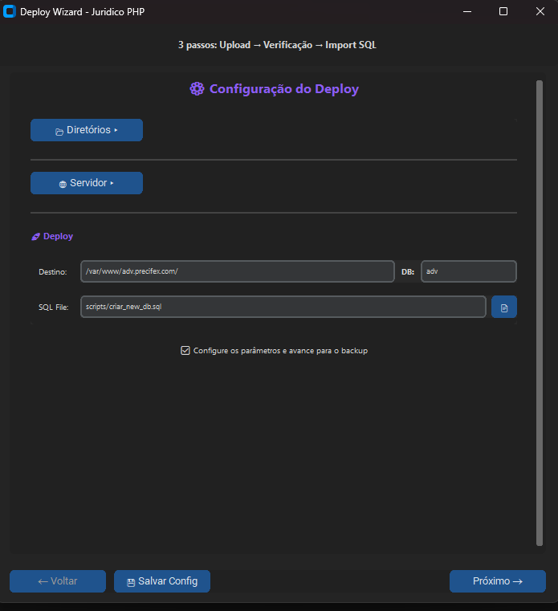

# 🚀 Deploy Wizard
Aplicação desktop para automatizar deploy de projetos PHP via PSCP, SSH e MySQL.

## 📋 Visão Geral

> * .venv\Scripts\python.exe .\main.py
> * .venv\Scripts\python.exe -m py_compile main.py

O **Deploy Wizard** é uma ferramenta visual que simplifica o processo de deploy em 3 passos:

1. **📤 Upload de Arquivos** - Envia arquivos via PSCP (PuTTY)
2. **🔍 Verificação** - Lista arquivos no servidor remoto
3. **🗄️ Import SQL** - Importa banco de dados via MySQL

## 🎯 Características

- ✅ Interface gráfica moderna (ttkbootstrap)
- ✅ Wizard de 3 passos simples
- ✅ Validação de campos em tempo real
- ✅ Execução assíncrona (não trava a interface)
- ✅ Salvar/carregar configurações
- ✅ Logs detalhados de cada deploy
- ✅ Suporte a SSH via Paramiko
- ✅ Tema dark moderno

## 📦 Requisitos

### Python
- Python 3.8 ou superior

## 🚀 ativar o venv

```bash
python -m venv venv
.venv\Scripts\activate
```

## 📦 Instale as dependências
```bash
python -m pip install -r requirements.txt
python -m pip install --upgrade pip
```

## Preview




### Ferramentas Externas
- **PSCP** (PuTTY Secure Copy) - [Download PuTTY](https://www.putty.org/)
  - Instalar e adicionar ao PATH do Windows
  - Ou o programa detecta automaticamente em `C:\Program Files\PuTTY\`

## 🚀 Instalação

### 1. Clone ou baixe o projeto

```bash
cd deploy_wizard
```

### 2. Instale as dependências

```bash
pip install -r requirements.txt
```

### 3. Execute o aplicativo

```bash
python main.py
```

## 📖 Como Usar

### Passo 1: Configurar Upload

1. **Path Local**: Selecione a pasta do seu projeto
2. **Host**: IP ou hostname do servidor (ex: `77.37.126.7`)
3. **Port**: Porta SSH (padrão: `22`)
4. **Username**: Usuário SSH (ex: `srodrigo`)
5. **Password**: Senha do usuário SSH
6. **Remote Path**: Caminho remoto no servidor (ex: `/var/www/adv.precifex.com/`)

Clique em **"Próximo →"** para iniciar o upload.

### Passo 2: Verificação

Após o upload, o wizard automaticamente:
- Conecta via SSH
- Lista todos os arquivos enviados
- Mostra quantidade de arquivos

Clique em **"Próximo →"** para continuar.

### Passo 3: Import SQL

1. **Database**: Nome do banco de dados (ex: `adv`)
2. **SQL File**: Caminho do arquivo SQL no servidor (ex: `scripts/criar_new_db.sql`)

Clique em **"Finalizar 🎉"** para importar o SQL.

### 💾 Salvar Configuração

Clique no botão **"💾 Salvar Config"** para salvar suas configurações e não precisar digitar novamente.

## 📁 Estrutura do Projeto

```
deploy_wizard/
│
├── main.py                 # Interface principal (Tkinter)
├── validators.py           # Validação de campos
├── deploy.py              # Lógica de deploy (PSCP, SSH, MySQL)
├── config_manager.py      # Gerenciamento de configurações
├── requirements.txt       # Dependências Python
│
├── config/
│   └── last_config.json   # Última configuração salva
│
├── logs/
│   └── deploy_*.log       # Logs de cada deploy
│
└── assets/
    └── (ícones e recursos)
```

## 🔧 Configuração Avançada

### Usar SFTP ao invés de PSCP

Se preferir usar SFTP (mais lento, mas com progresso em tempo real), edite `main.py` e substitua:

```python
self.deploy_manager.upload_files(self.data)
```

Por:

```python
self.deploy_manager.upload_files_with_progress(self.data, self.on_progress)
```

### Adicionar Callback de Progresso

```python
def on_progress(self, progress, message):
    self.status_upload.config(text=f"⏳ {progress:.0f}% - {message}")
    self.root.update()
```

## 🐛 Solução de Problemas

### PSCP não encontrado

**Erro**: `PSCP não encontrado. Instale o PuTTY e adicione ao PATH`

**Solução**:
1. Baixe o PuTTY: https://www.putty.org/
2. Instale no caminho padrão: `C:\Program Files\PuTTY\`
3. Ou adicione ao PATH do Windows

### Erro de autenticação SSH

**Erro**: `Erro de autenticação: usuário ou senha incorretos`

**Solução**:
- Verifique usuário e senha
- Teste conexão manualmente com PuTTY
- Verifique se o servidor permite autenticação por senha

### Erro "Permission denied"

**Solução**:
- Verifique permissões da pasta remota
- O usuário precisa ter permissão de escrita

### Import SQL falha

**Erro**: `ERROR 1045 (28000): Access denied`

**Solução**:
```sql
GRANT ALL PRIVILEGES ON database.* TO 'user'@'localhost' IDENTIFIED BY 'password';
FLUSH PRIVILEGES;
```

## 🎨 Temas Disponíveis

Temas do ttkbootstrap que você pode usar editando `main.py`:

```python
root = ttk.Window(themename="darkly")  # Atual (dark)
```

Outros temas:
- `"darkly"` - Dark theme (atual)
- `"cyborg"` - Dark blue
- `"vapor"` - Purple dark
- `"solar"` - Light theme
- `"flatly"` - Modern light
- `"cosmo"` - Clean light

## 📝 Logs

Todos os deploys geram logs em:
```
logs/deploy_YYYYMMDD_HHMMSS.log
```

Útil para:
- Debug de problemas
- Auditoria de deploys
- Histórico de operações

## 🔒 Segurança

- ⚠️ Senhas **não são salvas** no arquivo de configuração
- ✅ Conexões SSH são criptografadas
- ✅ Logs não contêm senhas
- ⚠️ Não compartilhe arquivos `config/last_config.json` (contém paths e usuários)

## 🚀 Próximos Passos

Melhorias futuras:
- [ ] Suporte a chaves SSH (sem senha)
- [ ] Múltiplos perfis de deploy
- [ ] Rollback automático
- [ ] Scheduler para deploys agendados
- [ ] Integração com Git
- [ ] Backup antes do deploy
- [ ] Notificações desktop
- [ ] Compilar para .exe (PyInstaller)

## 📚 Tecnologias Utilizadas

- **Python 3.8+**
- **ttkbootstrap** - Interface gráfica moderna
- **Paramiko** - Cliente SSH/SFTP
- **PSCP** - Upload rápido de arquivos

## 📄 Licença

Este projeto é de uso interno para automação de deploys.

## 👤 Autor

Desenvolvido para automatizar o processo de deploy do projeto Juridico PHP.

---

## 🎓 Dicas de Uso

### Primeira Vez
1. Configure todos os campos
2. Clique em "💾 Salvar Config"
3. Execute o deploy

### Próximos Deploys
1. Abra o programa (configs já carregadas)
2. Digite apenas a senha
3. Clique em "Próximo →"

### Debug
- Se algo falhar, verifique os logs em `logs/`
- Teste conexão SSH manualmente com PuTTY primeiro
- Verifique se PSCP está instalado: `pscp --version`

---

**🎉 Pronto! Seu deploy agora é automatizado e visual!**
